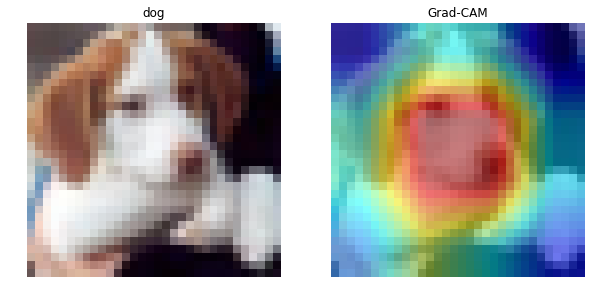
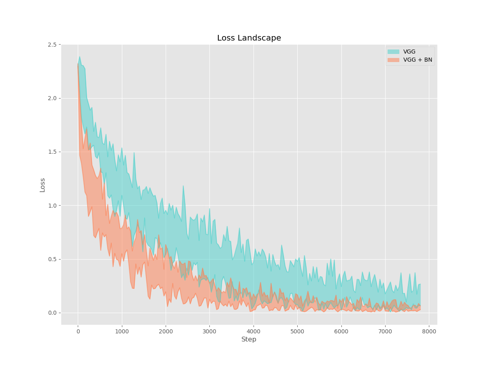
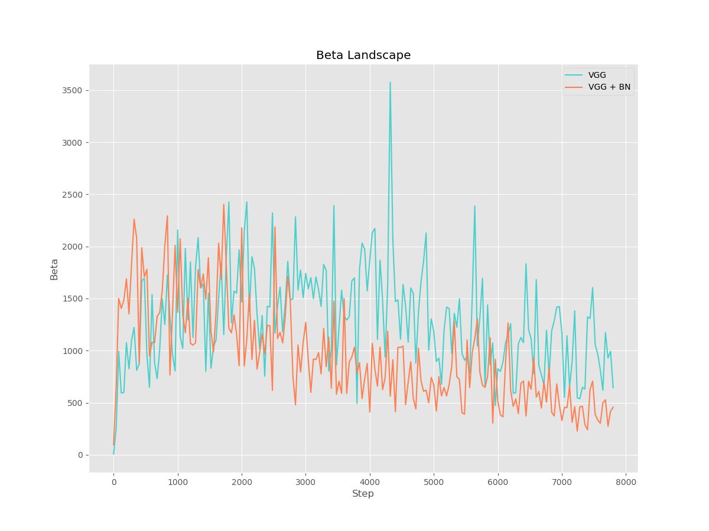
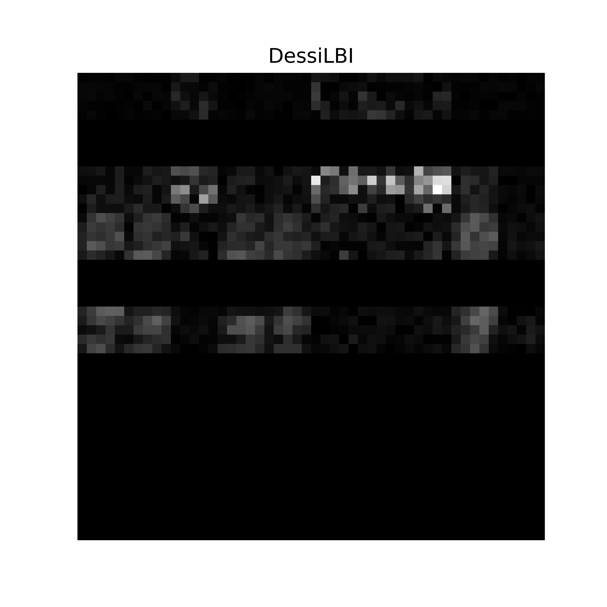

<h1 align = "center">Project 2: CIFAR, BatchNorm & DessiLBI</h1>

## TOC

- [Prerequisites](#Prerequisites)

- [CIFAR](#CIFAR)
- [BatchNorm](#BatchNorm)
- [DessiLBI](#DessiLBI)
- [Reference](#Reference)

## Prerequisites

- Ubuntu 16.04.5 LTS
- Python 3.6.8
- PyTorch 1.10.1
- PyTorch Vision 0.11.2

## CIFAR

### Usage

Run script, define log `<filename>` as you like.

```bash
nohup bash train.sh > ./log/<filename>.txt &
```

### Training Details

We train the models on the 50k training set and evaluate them on the 10k test set. The input images are 32x32 **randomly cropped** from the **zero-padded** 40x40 images or their **horizontally flipped versions**, and **normalization** is performed in the preprocessing step as well. **No other data augmentation is applied.** 
As for the optimizer, we simply use **SGD** with a mini-batch size of **128**, the momentum and weight decay are set to **0.9** and **5e-4** respectively. Furthermore, the learning rate of which is starting at **0.1** and decreasing by a factor of **0.5** when the test error plateaus, and the models are trained for **200** epochs.
For more code details, please refer to the attached [main.py](./code/cifar-10/main.py) file.

### General Results

|   architecture    | #params |                           error(%)                           |                         process                          |
| :---------------: | :-----: | :----------------------------------------------------------: | :------------------------------------------------------: |
|     ResNet-18     | 11.17M  |      [4.89](./code/cifar-10/log/all-200ep/resnet18.txt)      |    [img](./code/cifar-10/log/all-200ep/resnet18.png)     |
|  PreActResNet-18  | 11.17M  |   [5.12](./code/cifar-10/log/all-200ep/preactresnet18.txt)   | [img](./code/cifar-10/log/all-200ep/preactresnet18.png)  |
|     WRN-28-10     | 36.49M  | [**4.27**](./code/cifar-10/log/all-200ep/wideresnet28x10.txt) | [img](./code/cifar-10/log/all-200ep/wideresnet28x10.png) |
| ResNeXt-29, 32×4d |  4.77M  |  [4.85](./code/cifar-10/log/all-200ep/resnext29_32x4d.txt)   | [img](./code/cifar-10/log/all-200ep/resnext29_32x4d.png) |
|   DenseNet-121    |  6.96M  |    [4.78](./code/cifar-10/log/all-200ep/densenet121.txt)     |   [img](./code/cifar-10/log/all-200ep/densenet121.png)   |
|      DPN-26       | 11.57M  |       [5.21](./code/cifar-10/log/all-200ep/dpn26.txt)        |      [img](./code/cifar-10/log/all-200ep/dpn26.png)      |
|        DLA        | 16.29M  |        [5.02](./code/cifar-10/log/all-200ep/dla.txt)         |       [img](./code/cifar-10/log/all-200ep/dla.png)       |

### Ablation Experiments

| architecture | setting | #params |                           error(%)                           |                           process                            |
| :----------: | :-----: | :-----: | :----------------------------------------------------------: | :----------------------------------------------------------: |
|  ResNet-18   |  1x64d  | 11.17M  |   [4.89](./code/cifar-10/log/ablation-200ep/resnet18.txt)    |    [img](./code/cifar-10/log/ablation-200ep/resnet18.png)    |
|  ResNet-50   |  1x64d  | 23.52M  |   [5.37](./code/cifar-10/log/ablation-200ep/resnet50.txt)    |    [img](./code/cifar-10/log/ablation-200ep/resnet50.png)    |
|  ResNeXt-29  |  2x32d  |  2.30M  | [5.78](./code/cifar-10/log/ablation-200ep/resnext29_2x32d.txt) | [img](./code/cifar-10/log/ablation-200ep/resnext29_2x32d.png) |
|  ResNeXt-29  |  2x64d  |  9.13M  | [4.54](./code/cifar-10/log/ablation-200ep/resnext29_2x64d.txt) | [img](./code/cifar-10/log/ablation-200ep/resnext29_2x64d.png) |
|  ResNeXt-29  |  8x64d  | 89.60M  | [**4.19**](./code/cifar-10/log/ablation-200ep/resnext29_8x64d.txt) | [img](./code/cifar-10/log/ablation-200ep/resnext29_8x64d.png) |
|  ResNeXt-50  |  2x40d  | 17.30M  | [5.33](./code/cifar-10/log/ablation-200ep/resnext50_2x40d.txt) | [img](./code/cifar-10/log/ablation-200ep/resnext50_2x40d.png) |
|  ResNeXt-50  |  8x14d  | 20.86M  | [4.80](./code/cifar-10/log/ablation-200ep/resnext50_8x14d.txt) | [img](./code/cifar-10/log/ablation-200ep/resnext50_8x14d.png) |
|  ResNeXt-50  |  32x4d  | 22.98M  | [4.54](./code/cifar-10/log/ablation-200ep/resnext50_32x4d.txt) | [img](./code/cifar-10/log/ablation-200ep/resnext50_32x4d.png) |

### Other Inquiries

(Upper: Training. Lower: Test.)


### Network Interpretation

Using Grad Class Activation Map (Grad-CAM), check [notebook](./code/cifar-10/grad_cam.ipynb) .



### Final

Wide ResNet 28-10

- Test Acc: [96.65%](./code/cifar-10/log/final-200ep/wideresnet28x10.txt) 
- Training Process: [img](./code/cifar-10/log/final-200ep/wideresnet28x10.png) 

## BatchNorm

$$
\begin{gathered}
\mu_{\mathcal{B}}=\frac{1}{m} \sum_{i=1}^{m} x_{i} \\
\sigma_{\mathcal{B}}^{2}=\frac{1}{m} \sum_{i=1}^{m}\left(x_{i}-\mu_{B}\right)^{2} \\
\hat{x}_{i}=\frac{x_{i}-\mu_{\mathcal{B}}}{\sqrt{\sigma_{\mathcal{B}}^{2}+\epsilon}} \\
y_{i}=\gamma \hat{x}_{i}+\beta=\mathrm{BN}_{\gamma, \beta}\left(x_{i}\right)
\end{gathered}
$$

### Usage

Run script

```bash
nohup bash train.sh > nohup.out &
```

### Loss Landscape



### Gradient Predictiveness


### Beta Smooth



## DessiLBI



## Reference

1. [Train CIFAR-10 with PyTorch](https://github.com/kuangliu/pytorch-cifar) 
2. [Paper Review](https://sh-tsang.medium.com/overview-my-reviewed-paper-lists-tutorials-946ce59fbf9e) 
2. [Grad CAM on CIFAR-10](Grad Class Activation Map) 